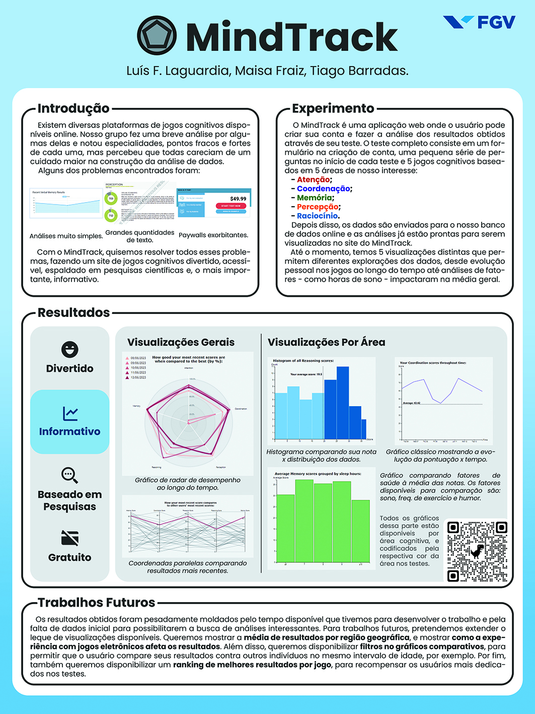

This is the repository for the project "MindTrack" for the Data Visualization course in Data Science.

For organizational purposes, the project was separated into three main "researches" points and three main "coding" points, divided among the three members.

**Video Introduction:**

[*Link for video*](https://clipchamp.com/watch/vwYtt8kmZxT)

**Poster:**

**Research:**

+ Research about cognitive tests, what are they, how to approach different tests. *This part was done by Maisa Fraiz.*
+ Research about visualization ideas relating to our project. *This part was done by Luis Laguardia.*
+ Research about Firebase and how to access the database through JavaScript. *This part was done by Tiago Barradas.*

**Coding:**

+ Coding the games. *This part was done by Luis Laguardia.*
+ Coding the graphs. *This part was done by Tiago Barradas.*
+ Coding the webpage. *This part was done by Maisa Fraiz.*

Regarding on how to access MindTrack, you can visit the webpage hosted on GitHub Pages: 

https://fgv-vis-2023.github.io/final-project-human-benchmark/

**Critiques and peer review**

*Critiques we have fixed:*

+ Visualizations without title or axis.
+ The first website page not being Home, but Graphs.
+ Radar graph needing to manually input data.
+ Graph page with elements of the template that do not make sense with MindTrack.
+ Lack of explanation and story-telling.
+ Lack of a tutorial on how to use the platform.
+ Lack of  a way to filter the graphs with the variables obtained.
+ Add a visualization allowing you to compare your results with the mean and median of other users.
+ Lack of a graph with more than five days.
+ Graphs not yet in the website.
+ Consistency in the color of the games and the graphs, creating a visual identity for each test.
+ Visualization showing the density of the data.

*Critiques we look forward to fixing:*

+ Making the games more dynamic.
+ Allowing the user to revisit the rules for the games.

There were some critiques we did not agree on (such as change in our colorblind friendly palette, graphs we thought redundant, or unfeasible suggestions) and those we do not plan to execute.

***Important!*** 

Trying to run the code locally might result in path errors, as the paths were made to accommodate GitHub Pages.
